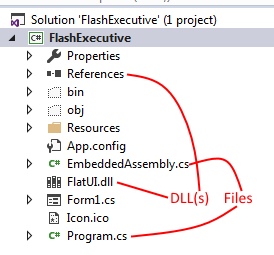

**Files Used Here:**

[EmbeddedAssembly.cs](EmbeddedAssembly.cs)

[Program.cs](Program.cs)

(Make sure to edit Program.cs in a C# viewer, be it Visual Studio Code, as a text viewer can "screw up" the look of it.)

Im presenting a Tutorial to Merge Assembly Files on the latest .NETs' (4.7.2 etc)

So first, download both files above. Well need them later. You will need to know basics of Visual Studio to do this.

# To start.

##### This Tutorial is about Embedding referenced DLLs into an EXE on compilation to make them One File.

Create a new Project on Visual Studio (I use 2017 but any of them works). Remember the name, and try to keep it simple.

Add the DLL(s) As a Reference in your project. Then add the same DLL(s) to your project as existing files. (Right Click Project > Add > Existing File > Your DLL(s))

## Lets get Coding.

First Add the EmbeddedAssembly.cs file to your project as an Existing file (Download above)

Next open the Program.cs file from your project and open the one you Downloaded above in a text editor.

Copy everything from MY program.cs to YOUR program.cs

Now Replace all instances of "YourProjectNameHere" with the name you gave the project when you created it.

and replace all instances of "DLLName.dll" with the name of the dll you added as a reference, AND as an existing file. By thw way make sure the DLL(s) you added earlier have the EXACT SAME NAME.

Now Save all

### Final Steps

Click on Your DLL(s) you put in references and change the setting "CopyLocal" to "false". 

Next Click on the DLL(s) you added as just existing files, and change the setting "Build Action" to "Embedded Resource"

#### The End:

If you followed my instructions PERFECTLY... Your hierarchy should look SOMETHING like this (Forget the project names and DLL names, those are just the names that I MYSELF used, but yours should be different.)

##### Final Words:

If this didnt work for you, or somehow gave you errors, then please read over the whole thing again, make sure you missed nothing, or get help from a friend.
